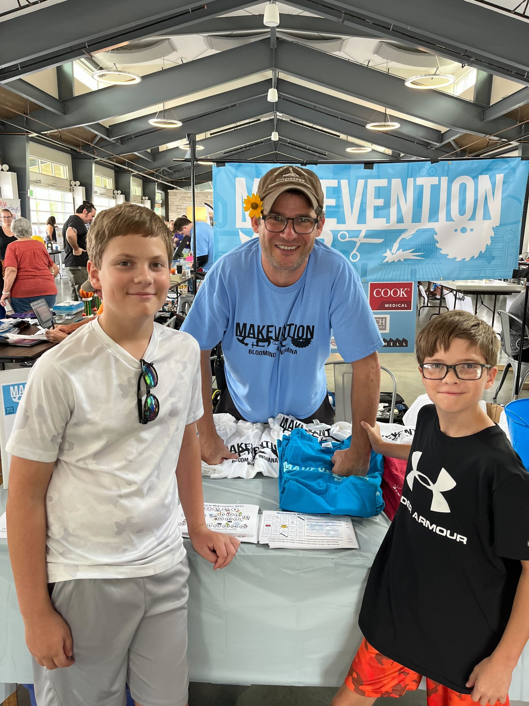

Want to exhibit at Makevention 2025? Whether you want to demonstrate your craft, show off your invention or maker services, or sell your creations, we have options for you to explore on our Exhibitors page.

## [Our host organization: Bloominglabs](https://www.bloominglabs.org)

This is Bloominglabs’ 13th year hosting Makevention! Come check out their tables and learn more about becoming a member!

Bloominglabs is space for sharing tools and knowledge to make stuff and is Indiana’s first hackerspace (also known as a makerspace). They are a group of people who rent a shared workshop with an amazing array of shared tools where they can build all kinds of projects both collectively and individually. Bloominglabs is located at 1840 S. Walnut Street.

To be involved with Bloominglabs, you can:

- Join BLabs for a monthly membership fee and build and make at the space, use the shared tools, and collaborate with the makers there;
- Attend low-cost workshops on all kinds of cool creative topics;
- Come to the public nights every Wednesday and try out the space;
- Or all of the above!

They are open to the public Wednesday evenings from 7pm until 10pm. Their open hours are family friendly. Come visit Bloominglabs at Makevention to learn more about their collective space, or visit [bloominglabs.org](https://www.bloominglabs.org).

## Maker Exhibitors:

Come check out all of our awesome makers at Makevention 2026 at Switchyard Park!

### A list of exhibitors will be added soon after exhibitor registration opens.

---

<!-- TODO: Add alt text. -->

