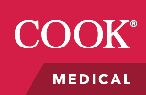
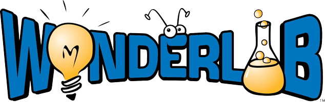
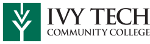

We can’t thank our sponsors enough, without their support Makevention could not happen!

---

## Gold Sponsors:

---

## Electrum Sponsors:

---

## Copper Sponsors:

## Sponsorship Information

Our budget is simple – renting the event space, insurance, and advertising. But without sponsors, we could not afford to put on Makevention and keep exhibitor fees low and attendance free. We can’t thank our sponsors enough; it’s your generosity and willingness to give that makes Makevention possible year after year!

If you’d like to sponsor Makevention, check out our [Sponsorship Prospectus](MakeventionSponsorshipAgreement2025.pdf), fill out a sponsorship agreement, and send it to us.

If you are on a tight budget, consider a donation at the Copper Level. For a donation of at least $50 or an equivalent in-kind donation, we’ll add your logo to our online presence.

Makevention is hosted by Bloominglabs. Bloominglabs Incorporated is a charitable non-profit with 501(c)3 status. Donations to Makevention are tax deductible.

Contact us at contact@makevention.org for more information.
